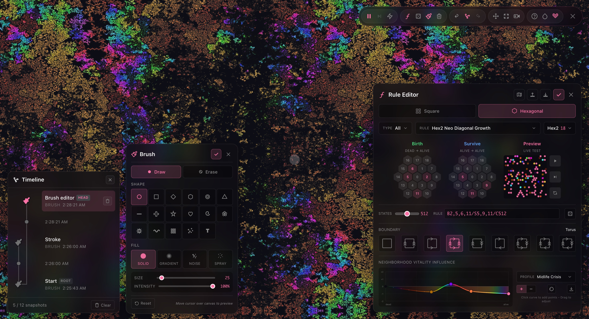
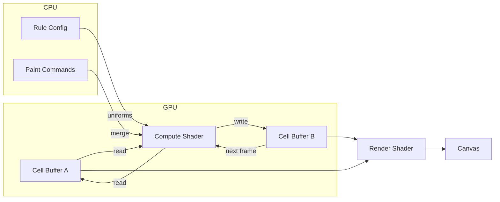

# Games of Life

A WebGPU-powered cellular automaton simulator. Runs entirely on the GPU for smooth performance even on large grids.

<p align="center">
  
</p>

**[Live Demo →](https://neovand.github.io/games-of-life/)**


## Features

- **Multiple Grid Types** — Square and hexagonal grids with different neighborhood sizes
- **5 Neighborhood Types** — Moore (8), Von Neumann (4), Extended Moore (24), Hexagonal (6), Extended Hexagonal (18)
- **9 Boundary Conditions** — Plane, Cylinder, Torus, Möbius Strip, Klein Bottle, Projective Plane
- **Multi-State Rules** — Up to 1024 states with colorful decay trails
- **18 Color Spectrum Modes** — From thermal gradients to neon bands
- **50+ Rule Presets** — From classic Conway's Life to artistic hexagonal patterns
- **Live Rule Editor** — Real-time preview as you tweak birth/survive conditions
- **Vitality Influence** — Dying cells can affect neighbor counting for complex dynamics
- **Continuous Seeding** — Auto-spawn patterns to keep simulations alive
- **Touch Support** — Pinch to zoom, pan mode for navigation on mobile

## How It Works

The simulation runs as a compute shader on the GPU. Each frame, the shader reads the current grid state, applies the cellular automaton rules in parallel across all cells, and writes to a second buffer. The buffers swap each frame (double buffering).



### Rule Encoding

Rules are encoded as bitmasks for fast GPU lookup:

```
B3/S23 (Conway's Life)
├── Birth mask:   0b000001000  (bit 3 set → birth with 3 neighbors)
└── Survive mask: 0b000001100  (bits 2,3 set → survive with 2 or 3)
```

The compute shader checks neighbors and uses bitwise AND to determine the next state—no branching required.

## Tech Stack

- **WebGPU** — Compute shaders for simulation, render shaders for visualization
- **Svelte 5** — Reactive UI with runes (`$state`, `$derived`, `$effect`)
- **SvelteKit** — Static site generation via `adapter-static`
- **TypeScript** — Type-safe GPU buffer management
- **WGSL** — WebGPU Shading Language for both compute and fragment shaders

## Running Locally

```bash
npm install
npm run dev
```

Requires a browser with WebGPU support (Chrome 113+, Edge 113+, Safari 18+, or Firefox Nightly with flags).

## Controls

| Key | Action |
|-----|--------|
| `Enter` | Play/Pause |
| `S` | Step forward |
| `B` | Toggle brush/pan mode |
| `Click` / `Right-click` | Draw / Erase |
| `Scroll` | Zoom |
| `Space` (hold) | Pan |
| `E` | Edit rules |
| `I` | Initialize grid |
| `R` | Reinitialize |
| `[ ]` | Brush size |
| `, .` | Speed up/down |
| `F` | Fit to screen |
| `T` | Toggle theme |
| `C` | Cycle colors |
| `?` | Help |

## License

MIT
