# How The Life Canvas Works

A comprehensive visual guide to understanding the Life in Life cellular automaton simulation architecture.

---

## Table of Contents

1. [High-Level Overview](#high-level-overview)
2. [Package Architecture](#package-architecture)
3. [The LifeCanvas Component](#the-lifecanvas-component)
4. [WebGPU Simulation Pipeline](#webgpu-simulation-pipeline)
5. [The Animation Loop](#the-animation-loop)
6. [Cell State & Rules](#cell-state--rules)
7. [Double Buffering Pattern](#double-buffering-pattern)
8. [User Interaction Flow](#user-interaction-flow)
9. [The Complete Data Flow](#the-complete-data-flow)
10. [Neighborhood Types](#neighborhood-types)
11. [Boundary Modes](#boundary-modes)

---

## High-Level Overview

The Life in Life project is a high-performance cellular automaton simulator built with **Svelte 5** and **WebGPU**. It runs Game of Life-style simulations entirely on the GPU for maximum performance.

```mermaid
flowchart TB
    subgraph User["👤 User Interface"]
        UI[Svelte UI Components]
        Controls[Controls & Settings]
        Canvas[Canvas Element]
    end
    
    subgraph State["🗄️ State Management"]
        Store[Simulation Store<br/>simulation.svelte.ts]
    end
    
    subgraph GPU["⚡ GPU Pipeline"]
        Compute[Compute Shader<br/>life-compute.wgsl]
        Render[Render Shader<br/>life-render.wgsl]
        Buffers[(Cell State Buffers)]
    end
    
    UI --> Store
    Controls --> Store
    Store --> GPU
    GPU --> Canvas
    Canvas --> User
    
    style GPU fill:#1a1a2e,stroke:#00d4ff,color:#fff
    style State fill:#1a1a2e,stroke:#ff6b6b,color:#fff
    style User fill:#1a1a2e,stroke:#4ade80,color:#fff
```



### Key Concepts

| Concept | Description |
|---------|-------------|
| **Cellular Automaton** | A grid of cells where each cell's next state depends on its neighbors |
| **WebGPU** | Modern GPU API for parallel computation and rendering |
| **Double Buffering** | Two buffers alternate: one reads, one writes (no race conditions) |
| **Ping-Pong Pattern** | Compute reads from A→writes to B, then reads from B→writes to A |

---

## Package Architecture

The project is organized as a monorepo with specialized packages:


### Package Responsibilities


---

## The LifeCanvas Component

The `LifeCanvas.svelte` component is the heart of rendering. Here's how it initializes and runs:


### Props & Configuration


---

## WebGPU Simulation Pipeline

The simulation uses two GPU pipelines working together:


### Buffer Architecture

```mermaid
flowchart TB
    subgraph Buffers["GPU Buffers"]
        CellA["Cell Buffer A<br/>u32 per cell<br/>width × height × 4 bytes"]
        CellB["Cell Buffer B<br/>u32 per cell<br/>width × height × 4 bytes"]
        ComputeParams["Compute Params (64 bytes)<br/>• width, height<br/>• birthMask, surviveMask<br/>• numStates<br/>• boundaryMode<br/>• neighborhood<br/>• vitalityMode + params"]
        RenderParams["Render Params (128 bytes)<br/>• grid/canvas dimensions<br/>• offset, zoom<br/>• colors, brush pos<br/>• spectrum settings"]
        VitalityCurve["Vitality Curve<br/>128 × f32 samples"]
        TextBitmap["Text Bitmap<br/>For text brush preview"]
        Readback["Readback Buffer<br/>For CPU reads"]
    end
    
    CellA <--> |"Ping-Pong"| CellB
    ComputeParams --> |"Uniforms"| ComputeShader[Compute Shader]
    VitalityCurve --> ComputeShader
    RenderParams --> |"Uniforms"| RenderShader[Render Shader]
    TextBitmap --> RenderShader
    
    style Buffers fill:#1a1a2e,stroke:#00ff88,color:#fff
```



---

## The Animation Loop

The main canvas runs a continuous animation loop that coordinates stepping and rendering:

```mermaid
flowchart TB
    Start([Animation Frame]) --> Check{simulation &&<br/>canvas ready?}
    Check -->|No| End([Next Frame])
    Check -->|Yes| ViewAnim[Update View Animation<br/>Smooth pan/zoom transitions]
    
    ViewAnim --> AxisAnim[Update Axis Animation<br/>Grow/shrink from center]
    
    AxisAnim --> Playing{isPlaying?}
    
    Playing -->|Yes| CalcSteps[Calculate steps to run<br/>based on speed & deltaTime]
    CalcSteps --> StepLoop[Run simulation.step()<br/>up to budget limit]
    StepLoop --> Seeding{Continuous<br/>seeding enabled?}
    Seeding -->|Yes| Seed[continuousSeed()]
    Seeding -->|No| Skip1[Skip]
    Seed --> GenUpdate[Increment generation count]
    Skip1 --> GenUpdate
    
    Playing -->|No| ResetTimers[Reset accumulators]
    
    GenUpdate --> SyncView[Sync view state to GPU<br/>colors, brush, spectrum, etc.]
    ResetTimers --> SyncView
    
    SyncView --> Render[simulation.render()<br/>Execute render pipeline]
    Render --> Recording{isRecording?}
    Recording -->|Yes| RecordRender[Render to recording canvas]
    Recording -->|No| Skip2[Skip]
    
    RecordRender --> Audio
    Skip2 --> Audio
    
    Audio[Update audio if enabled]
    Audio --> Stats[Update alive cell count]
    Stats --> RAF[requestAnimationFrame]
    RAF --> End
    
    style Start fill:#00d4ff,stroke:#fff,color:#000
    style End fill:#00d4ff,stroke:#fff,color:#000
```

### Timing & Step Budget


---

## Cell State & Rules

Each cell is stored as a single `u32` (unsigned 32-bit integer):


### Rule Bitmasks

Rules are encoded as bitmasks for ultra-fast GPU evaluation:

```mermaid
flowchart LR
    subgraph RuleExample["Example: B3/S23 (Conway's Life)"]
        Birth["Birth Mask<br/>Bit 3 = 1<br/>0b00001000 = 8"]
        Survive["Survive Mask<br/>Bits 2,3 = 1<br/>0b00001100 = 12"]
    end
    
    subgraph Evaluation["GPU Evaluation"]
        NeighborCount["neighbors = 3"]
        BirthCheck["birthMask & (1 << 3)<br/>8 & 8 = 8 ≠ 0<br/>✅ Birth!"]
        SurviveCheck["surviveMask & (1 << 3)<br/>12 & 8 = 8 ≠ 0<br/>✅ Survive!"]
    end
    
    RuleExample --> Evaluation
    
    style RuleExample fill:#1e3a5f,stroke:#60a5fa,color:#fff
    style Evaluation fill:#3a1e5f,stroke:#a78bfa,color:#fff
```



---

## Double Buffering Pattern

The ping-pong pattern prevents read/write conflicts:


### Bind Group Selection


---

## User Interaction Flow

Here's how user interactions flow through the system:


### Brush System


---

## The Complete Data Flow

From user interaction to pixels on screen:


---

## Neighborhood Types

The simulation supports multiple neighborhood configurations:


### Neighborhood Index Mapping


---

## Boundary Modes

Nine topological boundary conditions control edge behavior:

```mermaid
flowchart TB
    subgraph Plane["Plane (0)"]
        P["No wrapping<br/>Edges are dead"]
    end
    
    subgraph Cylinder["Cylinders"]
        CX["CylinderX (1)<br/>Horizontal wrap"]
        CY["CylinderY (2)<br/>Vertical wrap"]
    end
    
    subgraph Torus["Torus (3)"]
        T["Both wrap<br/>Donut shape 🍩"]
    end
    
    subgraph Mobius["Möbius Strips"]
        MX["MöbiusX (4)<br/>H-wrap + V-flip"]
        MY["MöbiusY (5)<br/>V-wrap + H-flip"]
    end
    
    subgraph Klein["Klein Bottles"]
        KX["KleinX (6)<br/>H-Möbius + V-cylinder"]
        KY["KleinY (7)<br/>V-Möbius + H-cylinder"]
    end
    
    subgraph Projective["Projective Plane (8)"]
        PP["Both edges flip<br/>Real projective plane"]
    end
```



### Boundary Wrapping Logic


---

## Summary

```mermaid
mindmap
  root((Life Canvas))
    Components
      LifeCanvas.svelte
      Canvas.svelte
      UI Controls
    WebGPU
      Compute Pipeline
        Rules evaluation
        Neighbor counting
        State transitions
      Render Pipeline
        Color mapping
        Grid lines
        Brush preview
    State
      Svelte 5 Runes
      $state, $derived, $effect
      Reactive updates
    Core Logic
      Rule parsing
      Neighborhoods
      Boundaries
      Vitality
    Performance
      GPU parallelism
      Double buffering
      60fps animation
      Step budgeting
```

---

## Getting Started

1. **Explore the packages**: Start with `@games-of-life/core` to understand rules and neighborhoods
2. **Read the shaders**: `life-compute.wgsl` shows the core CA logic
3. **Follow the data**: Trace from user click → `paintBrush()` → GPU buffer → shader → screen
4. **Experiment**: Modify rules in the UI and watch how behavior changes

Happy exploring! 🎮✨
